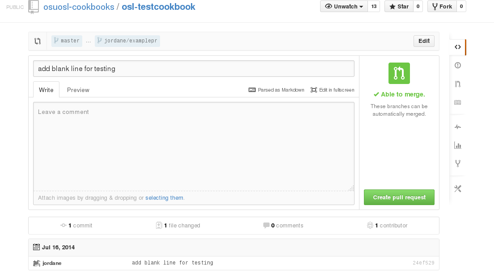
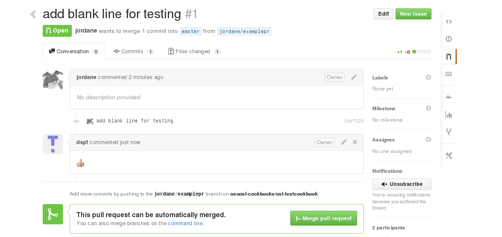
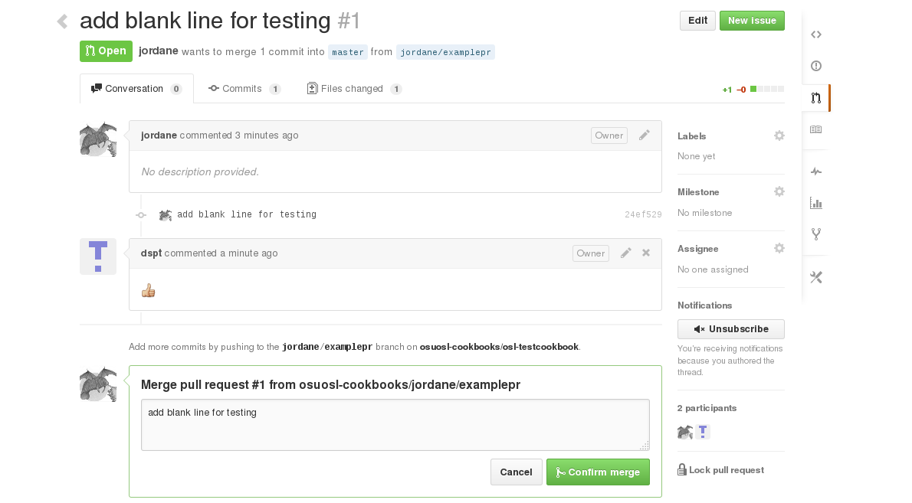
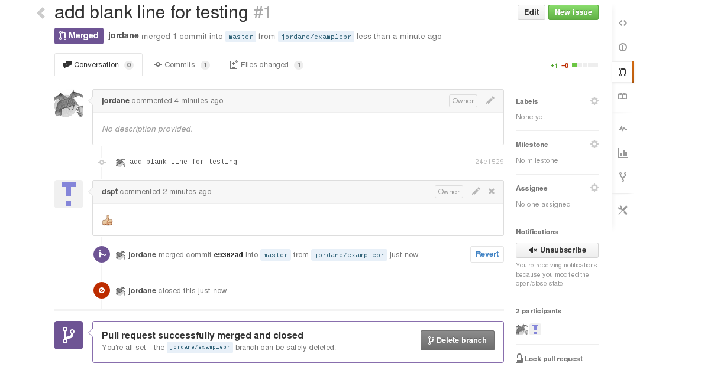

.. Chef Workflow slides file, created by
   hieroglyph-quickstart on Tue Jul  1 14:38:03 2014.

=============
Hands On Chef
=============

Foodcritic
==========

* Lints cookbooks
* Not Perfect
* Rules follow ``/FC\d\d\d/`` where the leading digits are padded 0s

.. code-block:: bash

    $ cd $some_cookbook
    $ foodcritic .
    $ foodcritic -t FC007 . # Only look for FC007 violations

Foodcritic Oddities
===================

.. code-block:: ruby

    # This violates FC025
    r = gem_package("chef-rewind") do
      action :nothing
    end

    r.run_action(:install)
    Gem.clear_path

    # This does not violate FC025, but should
    gem_package("chef-rewind") do
      action :nothing
    end.run_action(:install)
    Gem.clear_path

Don't be afraid to clean up code that doesn't violate Foodcritic rules.
It is probably wrong anyway

Fixing Foodcritic Violations
============================

http://acrmp.github.io/foodcritic/ has a great guide with examples and
descriptions for each and every rule.

|

.. image:: _static/FC025.png

Before Fix
==========

.. code-block:: bash

    $ foodcritic .
    FC025: Prefer chef_gem to compile-time gem install: ./recipes/default.rb:1

.. code-block:: ruby

    r = gem_package("chef-rewind") do
      action :nothing
    end

    r.run_action(:install)
    Gem.clear_path

After Fix
=========

.. code-block:: ruby

    chef_gem "chef-rewind"

Test Kitchen
============

*target*
    A target is a combination of driver, platform , and suite.

*driver*
    A driver tells test-kitchen how to spin up a VM.

*platform*
    A platform is the OS which the VM is running.

*suite*
    A suite is a chef run_list + a few other things

Targets
=======

* Named as ``suite-platform``

  - Each platform can only have one driver and provisioner
  - Each platform can have its own driver and provisioner configs
  - Other provisioner/driver configs are set as defaults

Example
=======
.. code-block:: yaml

    ---
    provisioner:
    name: chef_solo

    platforms:
      - name: centos-6.5

    suites:
      - name: default
        run_list:
          - recipe[osl-testcookbook::default]
      - name: wiki
        run_list:
          - recipe[osl-testcookbook::wiki]
        driver_config:
          network:
            - ["forwarded_port", {guest: 8080, host: 8080}]
      - name: style
        run_list:
          - recipe[osl-testcookbook::style]

Example
=======

.. code-block:: none

    $ kitchen list
    Instance             Driver   Provisioner  Last Action
    default-ubuntu-1204  Vagrant  ChefSolo     <Not Created>
    default-centos-65    Vagrant  ChefSolo     <Not Created>
    wiki-ubuntu-1204     Vagrant  ChefSolo     <Not Created>
    wiki-centos-65       Vagrant  ChefSolo     <Not Created>
    style-ubuntu-1204    Vagrant  ChefSolo     <Not Created>
    style-centos-65      Vagrant  ChefSolo     <Not Created>

.. code-block:: none

    $ ls test/integration/
    default/ wiki/
    $ ls test/integration/default
    serverspec/
    $ ls test/integration/default/serverspec
    default_spec.rb

The name ``default_spec.rb`` is arbitrary, but don't name it ``serverspec.rb``.
Just make sure the file ends in ``.rb``.

Serverspec
==========

.. code-block:: ruby

    # this is why the file shouldn't
    # be called 'serverspec.rb'
    require 'serverspec'

    include Serverspec::Helper::Exec
    include Serverspec::Helper::DetectOS

    %w[ vim-enhanced curl wget git bind-utils emacs ].each do |p|
      describe package(p) do
        it { should be_installed }
      end
    end

    describe package("emacs") do
      it { should_not be_installed }
    end

First
=====

.. code-block:: bash

    $ git clone git@github.com:osuosl-cookbooks/osl-testcookbook
    $ cd osl-testcookbook
    $ git checkout -b /username/learnstuff

Tasks
=====

* Fix the ``default`` recipe so it passes all the tests written for it
* Write the missing tests for the ``wiki`` recipe. Include tests for:

  + nginx package, service
  + existence of webroot and index.html
  + Everything in the ``http`` recipe that is included

* Fix all foodcritic issues:

  + Two in ``metadata.rb``
  + The rest in the ``style`` recipe.

* Add another platform and make all tests pass again

Bonus
=====

Bonus: Make ``wiki`` recipe support running the wiki with nginx or apache:

- Let ``node['osl-testcookbook']['webserver']`` be ``'nginx'`` or ``'apache'``
- Only install one of ``nginx`` or ``apache``
- Use the community-maintained ``apache2`` cookbook

Pull Requests!
==============

Push your branch:

.. code-block:: bash

    $ git push origin /user/dostuff

Open a pull request on github:

Pull Requests!
==============

Ask someone else to review it:

|

Pull Requests!
==============

Merge!

|

Pull Requests!
==============

Merged!

|

Pull Requests!
==============

Now continue about your upload process like normal (we won't actually do this)

.. code-block:: bash

    $ git fetch
    $ git checkout master
    $ git rebase

.. code-block:: bash

    $ knife spork bump $cookbookname
    $ git commit -m 'bump to version x.y.z'
    $ git tag vx.y.z # -a -s if you use gpg
    $ git push origin master --tags
    $ knife spork upload

.. code-block:: bash

    $ cd /whever/chef-repo/is
    $ for x in $envs; do knife spork promote $x $cookbookname; done
    $ git commit -m 'bump $cookbookname in $envs'

Bonus (LWRP)
============

An LWRP is a lightweight resource and provider.

* A resource uses a provider of the same name unless otherwise specified
* Doesn't require nearly as much boilerplate code
* Named based on file & cookbook name:

  + ``{resources,providers}/default.rb`` is named after cookbook
  + ``{resources,providers}/something.rb`` is ``#{cookbook}_something``

Example
=======

For example, in the yum cookbook:

.. code-block:: bash

    $ ls resources/
    globalconfig.rb repository.rb
    $ ls providers/
    globalconfig.rb repository.rb

These resources are called ``yum_globalconfig`` and ``yum_repository``.

Resource
========

``resources/default.rb``

.. code-block:: ruby

    actions :create
    default_action :create

    attribute :admin, :kind_of => [ String ], :default => nil
    # name_attribute => true sets the default value of the
    # attribute to be the same as the resource name
    attribute :conf_dir, :kind_of => [ String ], :name_attribute => true
    ...
    attribute :dbpersist, :kind_of => [ TrueClass, FalseClass ], :default => false
    ...
    attribute :web_root, :kind_of => [ String ], :name_attribute => true

.. code-block:: ruby

    moodle "/some/directory/" do
      dbpersist true
      config_dir "/some/where/else"
    end

Provider
========

``providers/default.rb``

.. code-block:: ruby

    action :create do
      converge_by("Create #{ @new_resource }") do # for whyrun
        create_moodle_instance
      end
    end

    def create_moodle_instance
      # resource attributes can be accessed as new_resource.attribute
      # including recipes is a bit different
      run_context.include_recipe "percona::server" if new_resource.dbhost == 'localhost'

      # using resources is the same though!
      template ::File.join(node['nginx']['dir'], "sites-available",
      new_resource.server_name + ".conf") do
        source "moodle-nginx.conf.erb"
        mode 0644
      end
    end
